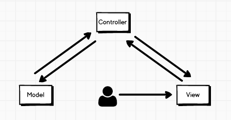
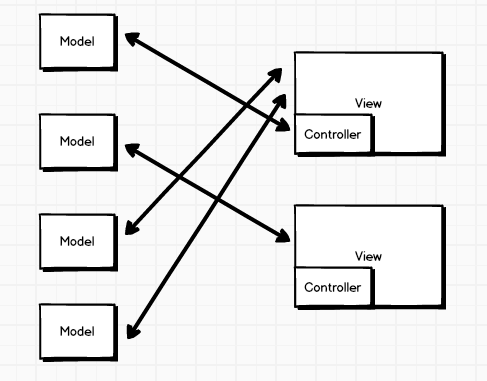
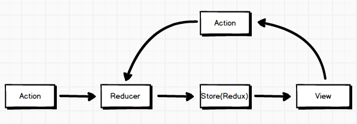

## Flux概述
Flux是Facebook用来构建用户端的Web应用程序的体系架构，与其它形式化的框架相比，它更像是一个架构思想，用于管理和控制应用中数据的流向。这里应用中的数据指包括但不限于来自服务端的数据页面中view的一些状态(如一个面板是展开还是关闭)，临时存储在本地需要持久化到服务端的数据等。

好了，说了这么多好像还是一脸懵逼，不慌，接下来看看展开式。


### MVC
在讲述Flux的同时，我们看看之前传统的MVC架构以及在前端中的一些问题继而思考Flux带来的改变。[MVC](https://zh.wikipedia.org/wiki/MVC)(Model-View-Controller)最先兴起于后端，通过对应用程序复杂度的简化使程序更加直观和便于维护。后端程序MVC中View可以看为数据的呈现，Model为数据的模型，Controller作为程序的流程控制。现在假设有这样的场景，用户想查看自己的profile页面，可能会有这样的流程：在页面上点击profile按钮(/profile?username=jiavan) => Controller接收到这一请求并获得请求的内容username=jiavan然后告知Model需要jiavan的数据 => Model返回了jiavan的数据 => Controller得到数据返回新的视图，看下流程：



现在前端中又有这样的场景：切换Menu中的Item，当前选中的Item颜色不同于其它颜色并且底部显示对应Item的内容。一般情况下我们会定义一个css class来作为当前选中Item的样式。当用户点击Item_A为被点击的元素新增高亮的class，其它兄弟元素移除该样式，这里的事件响应函数就是Controller，我们会在这里处理样式修改逻辑，以及更新Model的数据，然后新的数据及样式重新渲染界面。这种`VC<->M`的形式在关系比较简单的情况下是比较清晰容易控制的，但是复杂的页面上这样的模式可能会变得非常混乱：



之所以变得混乱了，因为很多view都具备修改多个model的能力，这里的单个修改行为可以称之为一个Action，一个Action的产生可能是用户行为，或者一个Ajax请求需要渲染新界面。对比上面后端传统MVC模式可以发现：

- 后端中Action作为一个URL请求，前端中可能是一个事件；
- 后端中Action处理被集中在Controller中，而前端中是分散的；

那么是不是可以把前端中修改状态即state的行为(事件回调/Ajax)全部抽象成一种Action描述，然后交付到一处即Reducers来进行原子化处理，然后Reducer修改整个应用中唯一的一棵state tree即Store，最后通过state->view的机制来重新渲染?

### Flux数据流框架
上面提到的几个概念已经对Flux有了初步的了解，下面进入正题。相信有了解Flux的都应该看过下面这张著名的数据流图：


0. Action可以看成是修改Store的行为抽象；
1. Dispatcher管理着应用的数据流，可以看为Action到Store的分发器；
2. Store管理着整个应用的状态和逻辑，类似MVC中的Model。

所以Flux可以被看作传统MVC的改进而非颠覆，当我第一次看到Flux的时候其实是比较懵逼，但看到Redux后

## Redux
按照Redux官方的描述`Redux is a predictable state container for JavaScript apps.`，其中`predictable`和`state container`体现了它的作用，Redux由Flux演变而来，但受 Elm 的启发，避开了 Flux 的复杂性，我们看看其数据流向：



### 重要概念
0. 应用中的所有state都以`一个object tree`的形式存储在一个单一的store中；
1. 唯一能改store的方法是触发action，action是`动作行为的抽象`；
2. 为了描述action如何改变state树，需要编写reducer函数。

这里需要说明一点的是reducer函数，它应当是一个纯函数，不应该有副作用，不应有API调用，`Date.now()`或者随机获取等不稳定的操作，应当保证相同的输入reducer计算的结果应该是一致的输出，它只会进行单纯的计算。编写reducer函数也是Redux中比较重要的一块，它的形式如下：
```javascript
function testReducer(state, action) {
  switch (action.type) {
    case ACTION_TYPE:
      // calc...
      return newState;
    default: return state;
  }
  return newState;
}
```
state是不可修改的，所以返回的新state应该是基于输入state副本的修改，而不是直接修改state后的返回。

### 原则
#### 单一数据源，store
整个应用的state被存放在一棵Object tree中，并且这个Object tree只存在唯一一个store中；

#### state是只读的
唯一能改变state的方法是触发action，action是对已经发生了的事情的抽象描述，简单的讲，它把行为抽象成了一个对象。

比如，删除一条记录的action可以抽象的理解为：

```javascript
{
  type: 'DELETE_ITEM',
  index: 1,
}
```

#### 使用纯函数来实现state归并操作，reducer
传入待修改的state和一个告知reducer如何修改state的action，reducer将返回action规则对应下操作后的新的state。

reducer(state, action) => new state

### 数据流
`严格的单向数据流是Redux设计的核心`

Redux应用数据的生命周期遵循下面4个步骤：
0. 调用store.dispatch(action), 可以在任何地方进行;
1. Redux store调用传入的reducer函数，并且将当前的state树与action传入。reducer是纯函数，只用于计算下一个state，它应该是完全可被预测的，相同的输入必定会有相同的输出，不能有副作用的操作，如API的调用或者路由跳转，这些应该都是在dispatch前产生；
2. 根reducer将多个子reducer输出合并成一个单一的state树；
3. Redux store保存了根reducer返回的完整的state树。

`新的state树就是应用的下一个状态`，现在就可以根据新的state tree来渲染UI。

## Redux实践
我们通过一个非常简单的计数器demo来梳理Redux的数据流。

### 0x00. 创建action
action其实就是一个普通的对象，只是对行为的抽象描述，这里我们可以把加上一个数描述为：
```javascript
{
  type: INCREMENT, //该动作的抽象描述
  number, // 该动作携带的数据
}
```
更多的时候我们会通过一个action生成函数来得到一个action：
```javascript
function incrementCreator(number) {
  return {
    type: INCREMENT,
    number,
  };
}
```

### 0x01. 创建reducer函数
reducer作为整个Redux中action的处理中枢，接收state与action并对此修改数据，返回应用的下一个状态。
```javascript
function countReducer(state, action) {
  switch (action.type) {
    case INCREMENT:
      return Object.assign({}, {
        counter: state.counter + action.number,
      });
    case DECREMENT:
      return Object.assign({}, {
        counter: state.counter - action.number,
      });
    default: return state;
  }
}
```
注意：上面我们已经提到多次，state是不可修改的，所以通过`assign`归并我们对数据的操作，返回的是state副本修改后的对象，并非直接修改了输入的state。

### 0x02. 创建唯一store
通过Redux中的createStore方法传入reducer函数来创建整个应用的store。
```javascript
const store = createStore(countReducer);
```

### 0x03. 修改state
通过store的dispatch方法来发起一个action。
```javascript
store.dispatch(incrementCreator(5));
store.dispatch(decrementCreator(4));
```

### 完整demo
```javascript
import { createStore } from 'redux';

// actions
const INCREMENT = 'INCREMENT';
const DECREMENT = 'DECREMENT';

// actionCreator，可以视为创建action的语法糖
function incrementCreator(number) {
  return {
    type: INCREMENT,
    number,
  };
}

function decrementCreator(number) {
  return {
    type: DECREMENT,
    number,
  };
}

// 初始化state
const initialState = {
  counter: 0,
};

// reducers函数，注意最后一定要return state防止不能匹配到action的时候state丢失
function countReducer(state = initialState, action) {
  switch (action.type) {
    case INCREMENT:
      return Object.assign({}, {
        counter: state.counter + action.number,
      });
    case DECREMENT:
      return Object.assign({}, {
        counter: state.counter - action.number,
      });
    default: return state;
  }
}

// 创建store
const store = createStore(countReducer);

// 订阅store的修改
const unsubscribe = store.subscribe(function log() {
  console.log(store.getState());
});

// 通过dispatch action来改变state
store.dispatch(incrementCreator(5)); //Object {counter: 5}
store.dispatch(decrementCreator(4)); //Object {counter: 1}

// 取消订阅
unsubscribe();
```
