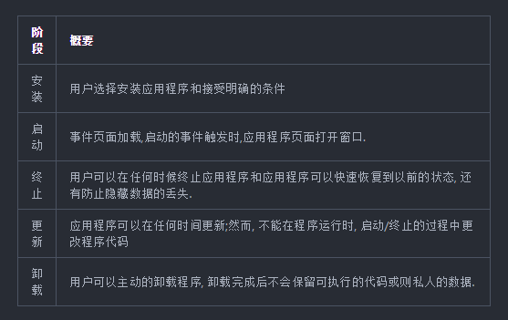

Chrome Apps紧密结合与用户的操作系统.设计他们的目的是为了作为一个单独的Tab独立于浏览器运行,在离线环境或则在网络连接性很差的情况下比起经典的web环境中还能具有强大的功能. 应用程序容器、编程和安全模型都满足这些Chrome应用程序的需求。

#### App容器模型
应用程序容器描述了Chrome应用程序的视觉外观和加载行为. Chrome Apps与传统的web页面看起来不一样是因为app容器不显示任何传统网页中的UI控件.它只显示一个矩形的空白区域, 这允许应用程序融合与“本地”系统上的应用程序, 而且可以防止用户通过手动更改程序的URL地址来混乱App的逻辑.

Chrome App的加载和不同的web app(web页面)不一样. 加载相同类型的内容: HTML和CSS, JavaScript文件, 然而, Chrome App是加载到app容器, 而不是在浏览器标签, 而且Chrome App必须要加载文件, 且文件资源来自本地, 这迫使所有Chrome App离线时至少有最低限度功能, 它还提供了一个地方执行更严格的安全措施。

<!--more-->

#### 程序设计模型
编程模型描述了Chrome应用程序的生命周期和窗口行为. 类似于本地应用, 这个编程模型的目的是让用户和他们的系统完全控制应用程序的生命周期. Chrome应用程序生命周期应该独立于浏览器窗口的行为或网络连接.

"**事件页面**"通过响应用户的手势和系统事件来管理Chrome App的生命周期, 这个页面是看不见的, 只存在于后台, 在系统运行的时候它可以自动的关闭. 它控制窗户打开和关闭, 当应用程序启动或终止的时候. **一个应用程序只能有一个事件页面**.

##### 关于App的生命周期
为详细说明如何使用编程模型,管理应用程序生命周期。下面是一个简短的总结Chrome应用程序生命周期的开始:

#### 安全模型
Chrome应用程序安全模型通过以安全的方式来管理用户信息, 从而来确保用户信息的安全. 遵守CSP包括详细信息如何遵守内容安全策略. 这一策略阻碍和减少了危险脚本和跨站点脚本漏洞,保护用户免受中间人攻击.

 与web页面相比, Chrome App从本地加载程序主页提供了一个更安全的地方来执行. 就像Chrome扩展,用户必须明确同意相信Chrome应用程序安装. 他们授予应用程序权限访问和使用他们的数据, 每个API,应用程序使用将拥有自己的许可, Chrome应用程序安全模型也能够在每个窗口的基础上设置权限分离, 这可以让你减少你的应用程序中的代码访问危险的api, 同时仍然使用它们.

Chrome应用程序重用Chrome扩展处理隔离, 再进一步通过隔离存储和外部内容, 每个应用程序都有自己的私人存储区域和不能访问另一个应用程序或个人的存储数据(如Cookie), 所有外部流程是孤立于应用程序, 一旦iframes与周围的页面运行在相同的环境中,他们只能用于加载其他应用程序页面, 您可以使用`object`标签嵌入外部内容, 这些内容单独运行在这个app的进程中.

译者注: 后面的安全模型翻译难度有点高, 若存在一些理解上的错误, 请参考Google官方文档.
