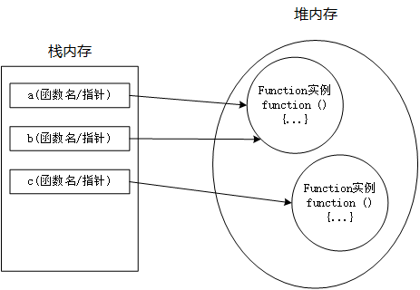

### Function类型
在ECMAScript中函数实际上是对象，每个函数都是Function类型的实例，且与其他引用类型一样具有属性和方法，由于函数的本质是对象，那么函数名应该是指向对象的指针。一个对象可以有多个引用，所以一个函数可以有多个函数名(指针)。函数的参数也不是必要的（有arguments对象），也没有函数签名的说法，这也是为什么js的函数不能重载。


<!--more-->

#### 定义函数的方式
0. 通过函数语法声明定义
```
function a(x, y) {
  return x + y;
}
```
1. 通过函数表达式定义
```
var a = function(x, y) {
  return x + y;
};
```
这看起来和上面才不多，实际在函数的功能上是一样的。
2. 使用Function的构造函数
```
var a = new Function("x", "y", "return x + y");//不常用
```

以上3种定义函数的方式我们都能使用同样的方式去调用a。
```
a(1,2);//3
```
那么3种方式的差别又是什么？先说用构造函数的形式：
第三种写法会导致解析两次代码，第一次是解析常规的ecmascript代码，第二次是解析传入构造函数中的字符串。1和2的区别得涉及到函数声明提升的过程。

### 函数声明提升
解析器在向执行环境中加载数据的时候，对于函数的声明和函数表达式的处理方法并不是一样的。解析器会 **先读取函数的声明** ，并使其在执行任何代码前可用。而函数表达式则必须 **等待解析器执行到所在代码行** ，才会执行:
```
console.log(a(1, 2));
function a(x, y) {
  return x + y;
}
```
以上代码是可以正常执行的，因为在代码执行前，解析器已经通过一个名为函数声明提升的过程，读取并将函数声明添加到执行环境中去了。在对代码求值的时候，js引擎在第一遍会声明函数并将他们放到源代码树的顶部。所以，即使声明函数的代码在调用函数的代码之后，js引擎也能把函数声明提升到顶部，如果像下面的例子将函数声明变为函数表达式就会出错：
```
console.log(a(1, 2));
var a = function(x, y) {
  return x + y;
};
```
以上错误的原因是函数在一个初始化语句中，而不是声明，在执行到`var a`之前，a没有函数的引用/地址，执行到第一行的时候就会找不到a标识符。

所以相对函数表达式语句来定义函数来说，通过函数声明的方式会有一个函数声明提升的过程，而表达式没有。
