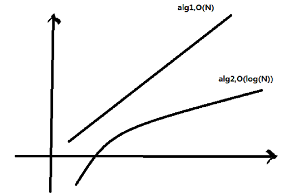

### 描述
计算x^n常见的算法就是使用n-1次乘法自乘，更高效的做法我们可以使用递归。以乘法的次数来作为运行时间的度量，下面是两种算法的比较。



算法2的数学原理:
- 若n为偶数`X^n = X^(n/2) * X^(n/2)`.
- 若n为基数`X^n = X^[(n-1)/2] * X^[(n-1)/2] * X`.

<!--more-->

### 实现
#### algorithm1
```c
long pow1(int x, int n)
{
	int i;
	long res;

	if(n == 0)
	{
		return 1;
	}

	res = x;
	for(i = 1; i< n; i++)/*进行n-1次自乘运算*/
	{
		res *= x;
	}
	return res;
}
```

#### algorithm2
```c
long pow2(long x, int n)
{
	if(n == 0)
		return 1;
	if(n == 1)
		return x;
	if(x % 2 == 0)
		return pow2(x * x, n / 2);
	else
		return pow2(x * x, n / 2) * x;
}
```

pow2(x \* x, n / 2) => 幂运算x^2 * x^(n/2)，当n较大时，算法2的乘法运算次数明显减少。
